# Week 0 — Billing and Architecture

## Billing
Billing console provides a general overview of your spending and other billing related matters

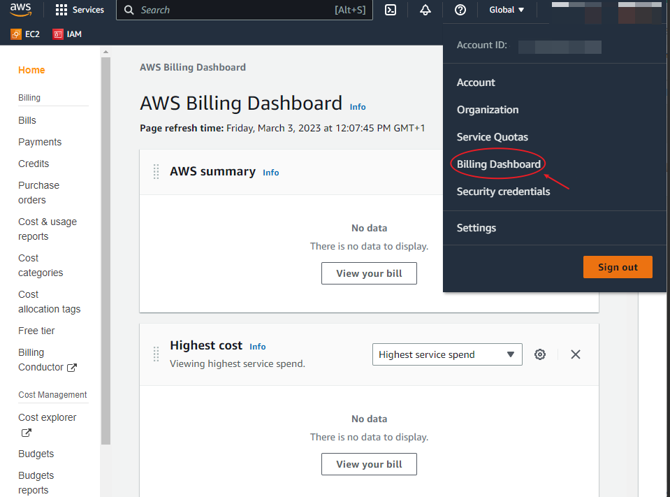

### Important Information in Billing

- Some services vary in pricing based on region
- Billing provides a breakdown of services and charges the they attract
- It provides a way to track free-tier utilization

Amazon Web Service Free tier account has 3 offers
* Free trials: These are services that can be used on for short period throughout the lifetime of the account, unless otherwise payed for. Examples are Amazon Redshift, Amazon SageMaker, Amazon Inspector

* 12 months Free: These are services that are free for up to 12 months and then charges begin to apply
Examples are: Amazon EC2, Amazon S3, Amazon Route 53, Amazon RDS
> **Note** : Caveat of this that some of these services e.e Amazon EC2 and Amazon S3 have actual usage hours **750hrs** attached to them, that adds up to a full month in hours.
However these hours can be spent simultenously e.g running multiple AWS EC2 instances at the same time or multiple S3 buckets.
This means the 750 hrs can be used up before the end of a month and for these extra usage, charges will apply

* Always free: As the name suggests, these services are not charged for any usage and are available for all customers. Example: AWS Lambda, Dynamo DB, Amazon Cloudwatch, Amazon SNS

To ensure that you are running within the free tier scope, especially  for the 12 months free services that can potentially be exhausted before the end 0of month, ensure to track your usage with the free tier option in Billing

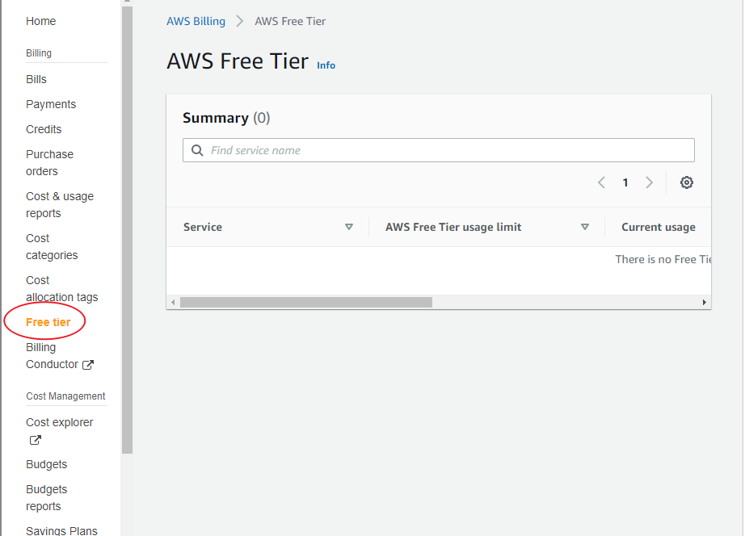

In the diagram above, no data is populated yet on this free account, however, ensure to check back at intervals to monitor your free tier usage

## Billing Alert

AWS provides an effective manage and track your spending. 

### Set up Billing Alert

There are 2 ways to manage billing alert

1. Manage Billing Alerts (old method):

- First update billing preferences to receive invoice and usage alerts via email

- Click on "Manage Billing Alerts" to set u alerts
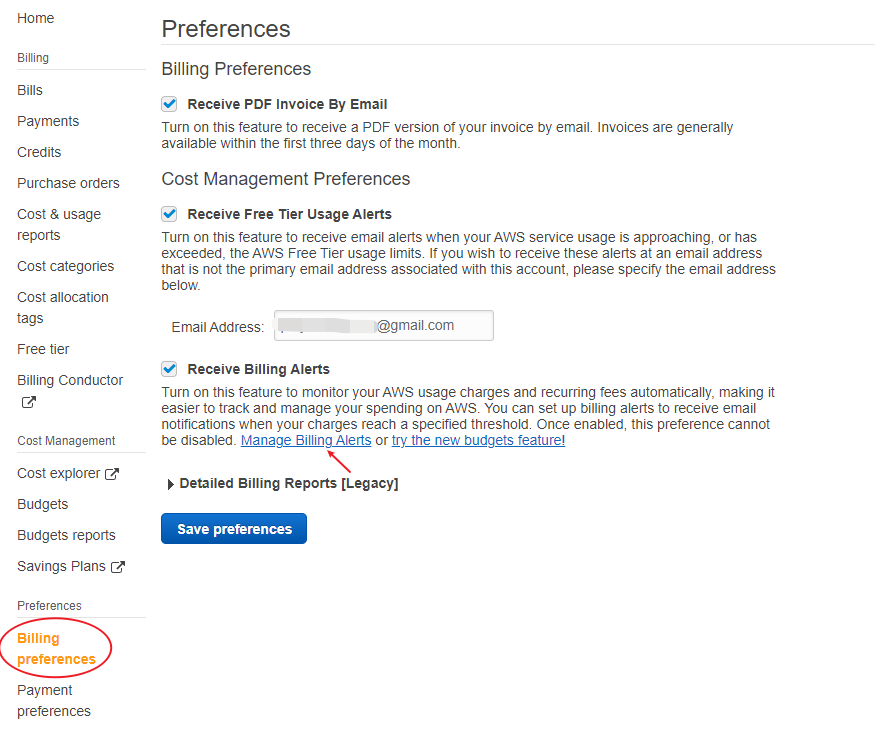

- Go to Cloud Watch > Alarms > In alarm > Select Metric > Billing > Total Estimated Charges > USD > Select Metric

> **Note** : Ensure to save the billing preferences before this step, otherwise billing will not be listed in the Metrics options

- Name the metric and set a threshold. $5 is the threshold set below 
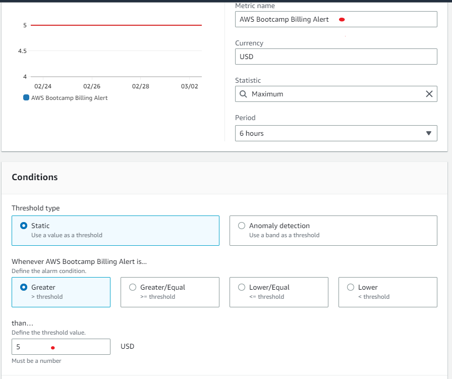

- Create a new sns topic if one doesn't exist already.

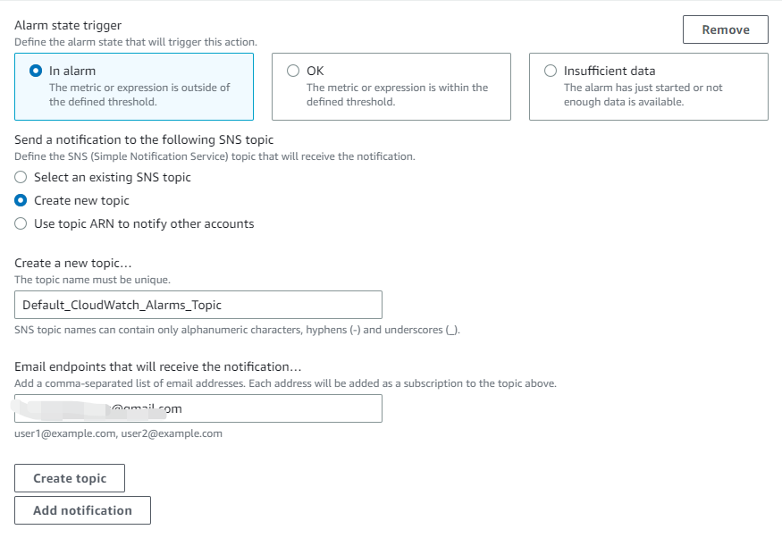

- Name the alert and click through to finish

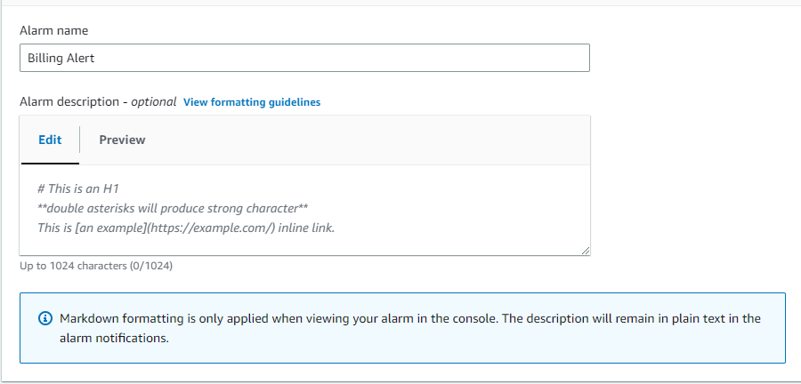

> **Note**: Only 10 free billing alerts are available for free tier account. Use it judiciously. :grinning:

2. Budgetting (New method)

- Select budget type. Name your budget, define your budget amount, provide email address and finish

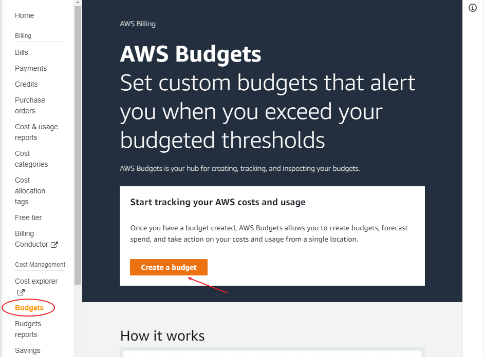
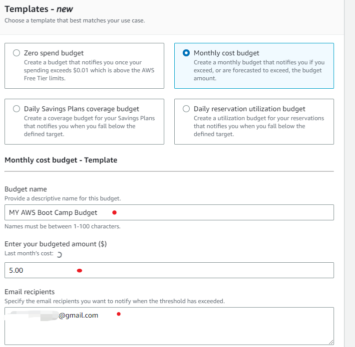

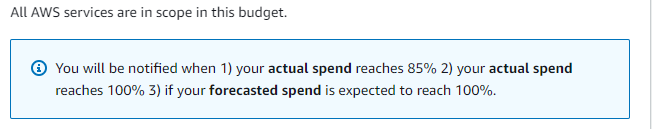

Threshold scope for notifications

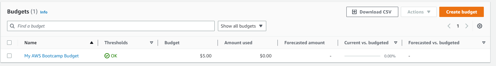

> **Note**: Only 2 free budgets can be created on a free tier accounts, subsequent creation will attract cost. So again, use with great care :+1:

##   Cost Allocation Tags

While the usage of Tags are not popular, but coat alloation tags can be very helpful to group cost based on business logic. 

This is especially helpful in a big instrasture and multiple business units are using same AWS build etc Tags can be used to track spending per business unit

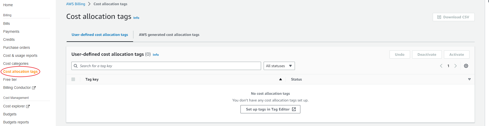

### Cost Explorer

- Provides interface to visualize , understand and manage soending and usage over specific period e.g montly, weekly, daily 

- Generate reports as desired

### Credits

View, redeem and track all credits on the account via the credits tab

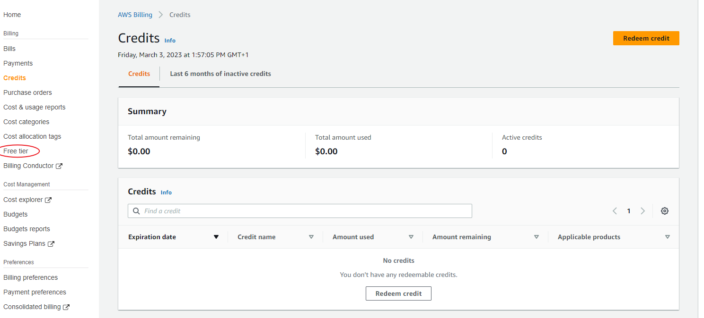

### Pricing Calculator

Use the calculator to get estimated cost of different service based on various conditions and usage

## Security in the cloud

Goal: To protect data applications and services in the cloud environment

- Reduces human error responsible for data leaks
- Reduce impact of breach

### Security Best Practises
** Identity and Access Management (IAM)
A. Add MFA to Root account

Disadvantages of using MFA
- log in anywhere
- need to carry authenticator with you anywhere

B. Create an Organization Unit

Organization: Provides a centralzed way to consolidate mulitiple AWS accounts in order to manage accounts, security policies, billings etc centrally.
Accounts are created in or invited into the organization by an administrator

Organization unit (OU): Allows you to group accounts together in other to manage and administer them as a single unit. E.g Policies can be attached to an OU which is then inherited by all accounts under it

Root Account: The root account is a management account and is recommended to only be used to create Organizations and Organization units. It should not have any applications or run any services or tasks
It should also not be frequently accessed and only be reserved for administrative tasks such as account creations and policy management.
It is recommended to be MFA enabled

- Creating Organization Units

Find the AWS Organization service in the seach bar > Create New Organization

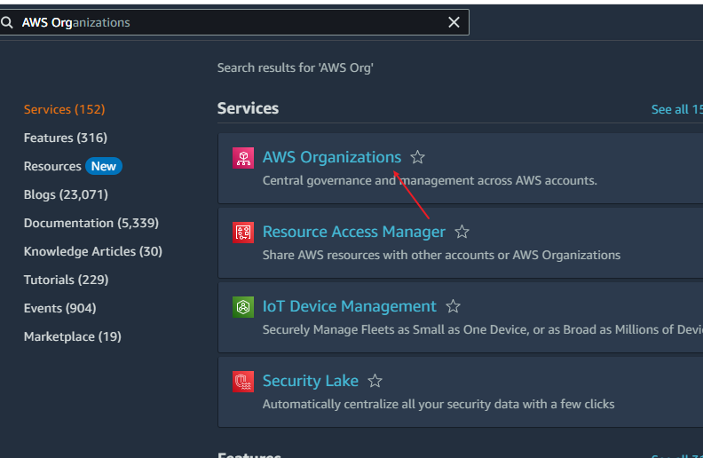

By default the root organization already exists and is attached to the user that created the AWS account

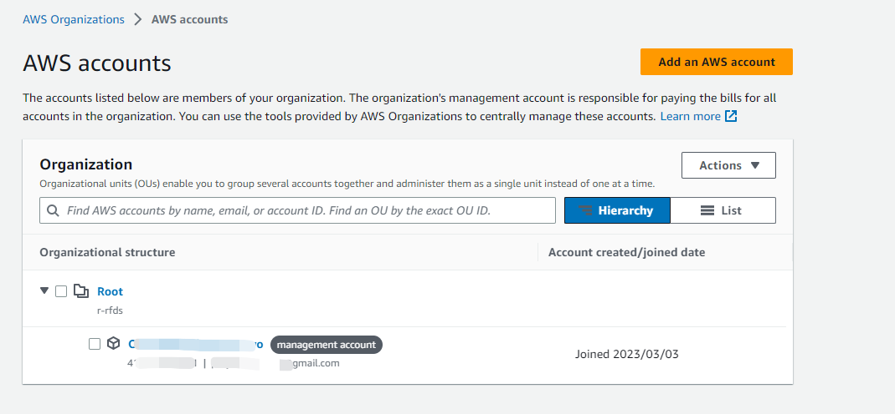

To create a new organization, check the root org so the create new OU option can be available

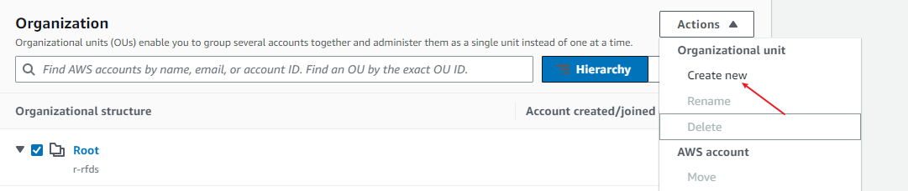

For this account, I created my OUs based on the projects I'm working on at the moment so I can track and managed usage per project. 

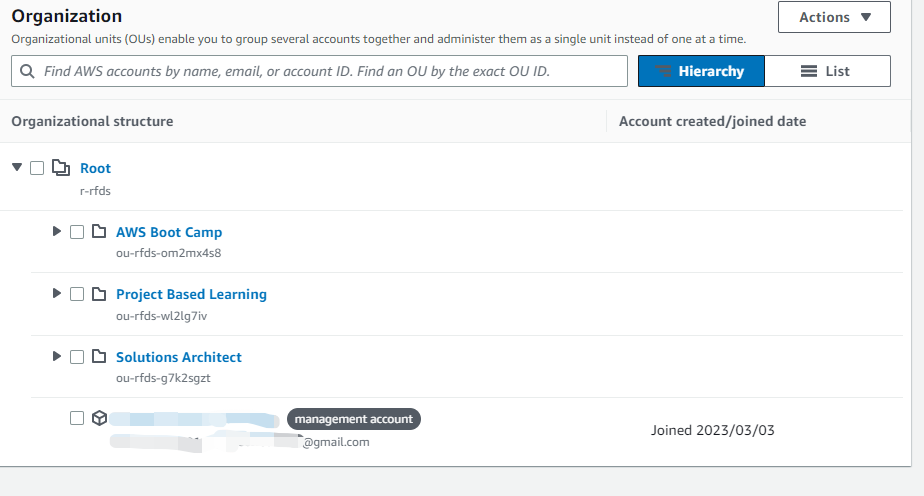

However most enterprise accounts create OU based on business logic/department e.g 

"Finance BU", "Engineering BU", "HR BU" or 
"Active Account" that holds accounts actively in use, "Standby Account" that holds account thats is readily available when needed

C. CloudTrail: Auditing service from AWS. It logs *all activities carried out on an AWS account

Follow the steps below to set up AWS cloud trail

- Name the event, check to enable trail for the entire account (i.e all OUs), name the KMS and add a tag

["Orgs"](0-asset/9.CloudTrail2.PNG)
["Orgs"](0-asset/9.CloudTrail3.PNG)

- Select management options

["Orgs"](0-asset/9.CloudTrail4.PNG)

Click through to complete registration

> **Note**: Some charges will apply

D Create IAM Users

IAM users are one of 3 types of users available in AWS. Other users are
- Federated user
- 
Create user

Follow the steps below to create user

["user"](0-asset/10.User.PNG)

Click through, add a tag and finish the user creation

* Download the csv provided. It has the login details as well as the sign on login for the user

Other activities that can be carried on this user account
- Set up MFA (since it has console access)
- Create access key from pro
- Add to a group
- Attach a policy e.g Administrator access if the user is to be an administrator access

["user"](0-asset/10.User5.PNG)